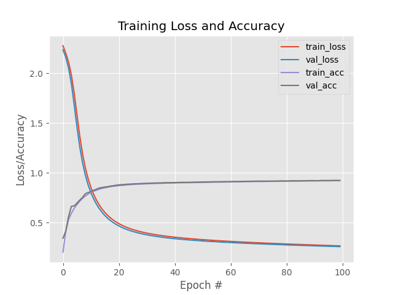
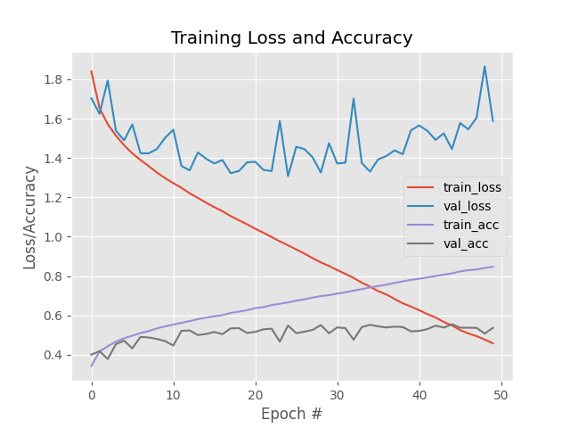

# Feedforward-NN-with-Keras-and-TensorFlow
Overview of creating basic feedforward neural networks with Keras / Tensorflow. We implement
feedforward multi-layer networks and apply them against the CIFAR-10 and MNIST datasets.
We won't get 'state of the art' results, but we'll demonstrate the very basics of using Keras.

## Description

Before we get into the datasets and their results, let's cover the key 'ingredients' when training
any NN. These four ingredients are:
1. Dataset
2. Loss Function
3. Model Architecture
4. Optimiziation Method

### Dataset
This one is pretty straightforward... the data itself. But we have to consider what problem 
we are trying to solve with our dataset. Are we using neural nets for regression analysis to predict
future values? Are we shooting to perform unsupervised learning? Are we trying to classify images?

We must know what the goal of our project should be for us to train a NN on the dataset.

### Loss Function
We need to define a loss function that aligns with our dataset and end goal. Since we are
focusing on image classficication in this project, we'll be focusing on cross-entropy loss. This 
is called categorical cross-entropy for >2 classes and binary cross-entropy for two class problems.

### Model / Architecture
NN architecture can vary wildly. Once we are at this point, we should know the following about our
dataset:

1. How many data points are in the dataset
2. How many classes are there
3. How the classes compare to eachother (similarity)
4. Intra-class variance

Knowing the above, this should provide some insight on the architecture that should be used. We can't
expect to get the optimal parameters / architecture on the first run. The more results we gather and
options we try, we can make informed decisions on where to go and what to try next.

### Optimiziation Method
What optimization method should be used? How should we update our weights? Some popular methods:

1. SGD (Stochastic Gradient Descent)
2. RMSprop
3. Adam
4. Adadelta
5. and so on...

SGD remains the 'workhorse' of deep learning optimization methods. Because of this, SGD is
usually our first choice. We need to know how to set the proper learning rate and regularization strength, number of epochs,
whether or not to include momentum or Nesterov acceleration. It may take 10's to 100's of experiments
depending on the dataset.

### Other: Weight Initialization
There are many ways to initialize weights, this site here does a good job highlighting popular
methods:  
https://pyimagesearch.com/2021/05/06/understanding-weight-initialization-for-neural-networks/?_ga=2.177462117.1119707357.1647809282-1931257770.1641919015

Some popular methods:
1. Constant
2. Uniform and Normal Distributions
3. LeCun Uniform and Normal
4. Glorot/Xavier Uniform and Normal
5. He et al./Kaiming/MSRA Uniform and Normal

## Results
### MNIST Dataset
Code can be found in 'scripts/mnist_example_keras.py'.  

For this dataset we use a 784-256-128-10 architecture with 100 epochs and a learning
rate (SGD) of 0.01.

The results summary can be seen below:
```buildoutcfg
              precision    recall  f1-score   support

           0       0.94      0.98      0.96       980
           1       0.97      0.97      0.97      1135
           2       0.92      0.91      0.92      1032
           3       0.91      0.91      0.91      1010
           4       0.92      0.93      0.93       982
           5       0.90      0.86      0.88       892
           6       0.93      0.94      0.94       958
           7       0.94      0.93      0.93      1028
           8       0.90      0.89      0.89       974
           9       0.91      0.91      0.91      1009

    accuracy                           0.92     10000
   macro avg       0.92      0.92      0.92     10000
weighted avg       0.92      0.92      0.92     10000
```

The training loss and accuracy plot for both the training and validation 
datasets can be seen below:



As we can see, the training and validation curves match almost perfectly. This is a good example
of no overfitting or other issues in training of the model. Overall, we get 92% accuracy. Which isn't exactly bad
but we can do much better with Convolutional Neural Networks.

### CIFAR-10 Dataset
Code can be found in 'scripts/cifar10_example_keras.py'.  

For this dataset we use a 3072-1024-512-10 architecture with 50 epochs and a learning
rate (SGD) of 0.01.

The results summary can be seen below:
```buildoutcfg

```

The training loss and accuracy plot for both the training and validation 
datasets can be seen below:



Unlike the MNIST example above, we see by examining the plot of loss and accuracy that we
struggle with overfitting after the initial few epochs. Although loss initially decreases, it shoots up
and doesn't seem to come down again all while our training loss consistently decreases. This 
is a great example of extreme overfitting.  

So what do we do if our basic feedforward NN with fully connected layers is not performing
for our dataset? ... Convolutional Neural Networks!

## Getting Started

### Dependencies

See requirements.txt

### Installing

#### Clone the project:
```
git clone git@github.com:reedajohns/Feedforward-NN-with-Keras-and-TensorFlow.git
```

### Executing program

Open terminal and run either command:
```
python mnist_example_keras.py
python cifar10_example_keras.py
```

## Authors

Contributors names and contact info

Reed Johnson (https://www.linkedin.com/in/reed-a-johnson/)

## Version History

* 0.1
    * Initial Release

## License

This project is licensed under the GNU GENERAL PUBLIC License - see the LICENSE.md file for details

## Acknowledgments

Inspiration, code snippets, etc.
* [Pyimagesearch](https://pyimagesearch.com/2021/05/06/implementing-feedforward-neural-networks-with-keras-and-tensorflow/?_ga=2.144243701.1119707357.1647809282-1931257770.1641919015)